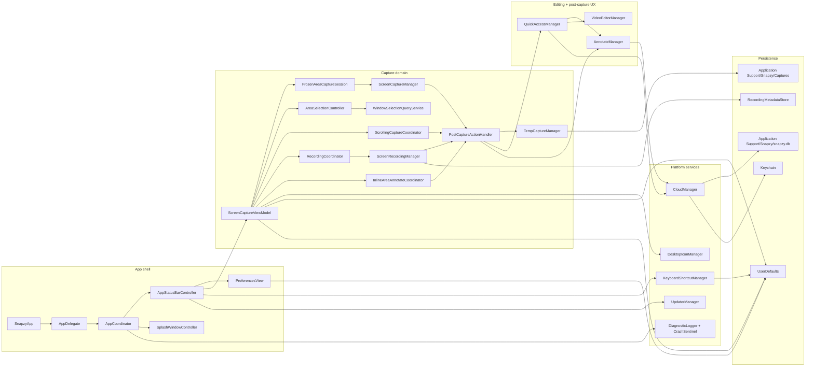

# Project Structure & Runtime Architecture

This doc mirrors the current Snapzy codebase and runtime ownership. Keep it in sync with source, not with intended architecture.

## Runtime Map



## Source Tree

```text
tools/
  localization/
    CatalogTool.swift

Snapzy/
  App/
    SnapzyApp.swift
    AppCoordinator.swift
    AppEnvironment.swift
    AppStatusBarController.swift

  Features/
    Annotate/
    Capture/
    CrashReport/
    Onboarding/
    Preferences/
    QuickAccess/
    Recording/
    Shortcuts/
    Splash/
    Updates/
    VideoEditor/

  Services/
    AppIdentity/
    Appearance/
    Capture/
      AreaSelectionBackdrop.swift
      AreaSelectionWindow.swift
      WindowSelectionQueryService.swift
      ScrollingCapture/
    Clipboard/
    Cloud/
    Diagnostics/
    FileAccess/
    Media/
    Shortcuts/
    Updates/
    Wallpaper/

  Shared/
    Components/
    Extensions/
    Localization/
    Services/
    Styles/

  Common/
    Components/

  Config/
  Resources/
    Localization/
      Shared/
        *.xcstrings
      Features/
        *.xcstrings
      Generated/
      manifest.json
    *.lproj/

SnapzyTests/
  Services/
    Capture/
      *Tests.swift
  Features/
    Capture/
    Annotate/
    VideoEditor/
    QuickAccess/
  Shared/
    Extensions/
  Helpers/
  Fixtures/

SnapzyUITests/
  Features/
    Onboarding/
    Preferences/
    Annotate/
    QuickAccess/
```

## Feature Roots

| Path | Owns |
| --- | --- |
| `App/` | Entry point, app lifecycle, menu bar bootstrap, preferences wiring |
| `Features/Splash/` | Splash window, onboarding root coordinator, intro flow, multilingual welcome screen |
| `Features/Onboarding/` | Onboarding step views and visual system, including first-run language selection |
| `Features/Capture/` | High-level screenshot, OCR, cutout, scrolling-capture, and recording entry actions |
| `Features/Recording/` | Recording toolbar, overlays, live annotation, stop/GIF handoff |
| `Features/QuickAccess/` | Floating post-capture stack, temp-file persistence UX, drag-to-app |
| `Features/Annotate/` | Image editor, export, crop, blur, mockup, cutout-aware editing, inline area annotate |
| `Features/VideoEditor/` | Trim, zoom, background, Smart Camera, GIF/video export |
| `Features/Preferences/` | General, Capture, Quick Access, Shortcuts, Permissions, History storage/retention, Cloud, About tabs |
| `Features/Shortcuts/` | Keyboard shortcut cheat-sheet overlay |
| `Features/Updates/` | Sparkle menu binding and update UI bridge |
| `Features/CrashReport/` | Crash report prompt and diagnostics UX |

## Service Roots

| Path | Owns |
| --- | --- |
| `Services/Capture/` | ScreenCaptureKit capture engine, area selection overlay/controller, OCR scanning overlay, window-target resolution, recording engine, temp storage, post-capture routing |
| `Services/Capture/ScrollingCapture/` | Long screenshot session model, live preview, stitcher, HUD, metrics |
| `Services/Cloud/` | S3/R2 providers, upload orchestration, GRDB history, Keychain credentials, encrypted transfer |
| `Services/FileAccess/` | Sandbox-scoped save-folder permissions and bookmarks |
| `Services/Media/` | OCR, QR payload detection, foreground cutout, GIF conversion helpers, WebP encode |
| `Services/Shortcuts/` | Global shortcuts, conflict detection, system shortcut checks |
| `Services/Diagnostics/` | Crash sentinel, logs, toasts, cleanup |
| `Services/Updates/` | Sparkle updater bootstrap |
| `Services/Wallpaper/` | Desktop icon and wallpaper helpers used by capture/editor UX |
| `Services/Appearance/` | Theme and appearance mode management |
| `Shared/Localization/` | Shared localization helpers for AppKit, service copy, alerts, toasts, and display labels |

## Persistence Map

```text
~/Library/Application Support/Snapzy/
  Captures/
    <temp screenshot or recording files when Save is OFF>
    RecordingProcessing/
      <per-session AVAssetWriter processing directories>
    RecordingMetadata/
      index.json
      Entries/
        <uuid>.json
  snapzy.db
```

| Store | Used for |
| --- | --- |
| `UserDefaults` | Preferences, shortcut configs, onboarding flags, feature toggles |
| `Keychain` | Cloud access key, secret key, optional cloud protection password |
| `Application Support/Snapzy/Captures/` | Temp captures, per-session recording processing files, and recording metadata sidecars |
| `Application Support/Snapzy/snapzy.db` | Cloud upload history via GRDB |

## Implementation Notes That Matter

- `ScreenCaptureViewModel` is the main entrypoint for capture actions fired from shortcuts or the status bar menu.
- `AppStatusBarController` is the AppKit bridge for the menu bar item. It now keeps the menu accessible during active recording, renders the live recording timer from `ScreenRecordingManager`, and coordinates temporary Preferences-window exclusion for record-own-app sessions.
- Area screenshot now freezes the active display first through `FrozenAreaCaptureSession`, then keeps one overlay session that can toggle between manual region selection and application window selection with the configurable `Application Capture` overlay key. The default key is `A`.
- Area + inline annotate uses `InlineAreaAnnotateCoordinator` with `InlineAreaAnnotateSession` and `InlineAreaAnnotateWindow`. It starts after a frozen all-display snapshot set, creates coordinated per-display panels that share one desktop coordinate space, reuses Annotate state/canvas/export services, and routes the saved image through `PostCaptureActionHandler`.
- `AreaSelectionController` and `AreaSelectionWindow` own the cross-display overlay session, target-display keyboard ownership for screenshot sessions, and highlight rendering for both manual and application screenshot interaction modes.
- `WindowSelectionQueryService` resolves the hovered topmost app window from CoreGraphics window lists plus `SCShareableContent`, so app-mode hover stays accurate without doing expensive live queries on every draw pass.
- `PostCaptureActionHandler` executes Quick Access, clipboard copy, and screenshot auto-open in Annotate after files already exist.
- `TempCaptureManager` is where the `Save` after-capture toggle becomes real behavior. Recording uses an internal per-session processing directory first, then moves the final video to export or the temp capture root after AVAssetWriter finishes.
- `QuickAccessActionConfigurationStore` owns user-configurable Quick Access action visibility, context-menu order, and card slot assignments. Settings → Quick Access lets users reorder the context menu from the list, then drag actions onto explicit preview slots for the live hover card layout.
- `RecordingCoordinator` owns the toolbar/overlay UX. `ScreenRecordingManager` owns the media pipeline.
- `ScrollingCaptureCoordinator` is its own subsystem. Treat `Services/Capture/ScrollingCapture/*` as a unit.
- `ScrollingCaptureFrameSource` publishes timestamped region frames into `ScrollingCaptureFrameRing`, so live preview and commit/stitch decisions share one bounded frame timeline before falling back to still area capture.
- `CloudManager` is a facade. Provider-specific behavior lives under `Services/Cloud/`.
- `Shared/Localization/L10n.swift` is the bridge for user-facing copy that does not live directly in SwiftUI view literals.
- `Resources/Localization/Shared/*.xcstrings` and `Resources/Localization/Features/*.xcstrings` are the runtime localization catalogs.
- `tools/localization/CatalogTool.swift` owns audit and verify for split localization catalogs.
- `Resources/*/InfoPlist.strings` still own privacy permission text.
- Keep brand names, file formats, key labels, MIME types, and other technical tokens verbatim unless product behavior explicitly changes.

## Test Architecture

Snapzy uses peer test roots at the repository root so test code stays out of
the app source folder and Xcode can bind each root to the correct target.

- **SnapzyTests** — Unit Testing Bundle. Mirrors the `Snapzy/` source tree by
  domain, for example `SnapzyTests/Services/Capture/*Tests.swift` tests
  `Snapzy/Services/Capture/*`.
- **SnapzyUITests** — planned UI Testing Bundle for end-to-end user flows.

Current Xcode project contract:

- `Snapzy.xcodeproj` has a file-system synchronized root group for
  `SnapzyTests/`.
- The shared `Snapzy` scheme uses `Snapzy.xctestplan`, which includes
  `SnapzyTests` in its Test action.
- Test helpers live in `SnapzyTests/Helpers/`.
- Fixtures, when needed, should live in `SnapzyTests/Fixtures/`.

Do not place XCTest files under `Snapzy/`; that folder is synchronized into the
app target.

Directory structure mirrors the app: `SnapzyTests/Services/Cloud/AWSV4SignerTests.swift` tests `Snapzy/Services/Cloud/AWSV4Signer.swift`. Shared mocks and fixture assets live in `SnapzyTests/Helpers/` and `SnapzyTests/Fixtures/`.

### Test Priority

| Layer | Type | Priority | Notes |
| --- | --- | --- | --- |
| `Services/Cloud/AWSV4Signer` | Unit | **P0** | Pure crypto, zero deps |
| `Services/Cloud/LifecycleXMLParser` | Unit | **P0** | Pure XML parsing |
| `Services/Capture/CaptureOutputNaming` | Unit | **P0** | Template + sanitization |
| `Shared/Extensions/` | Unit | **P0** | Pure utilities |
| `Services/Media/` | Unit | **P1** | Vision/CoreImage, needs fixture images |
| `Services/Capture/TempCaptureManager` | Unit | **P1** | File lifecycle, mock `FileManager` |
| `Services/Capture/PostCaptureActionHandler` | Unit | **P1** | Routing logic, protocol DI |
| `Services/Cloud/CloudManager` | Integration | **P2** | Facade, mock providers |
| `Features/Capture/CaptureViewModel` | Unit | **P2** | State transitions only, high coupling |
| `Features/Onboarding/`, `Features/Preferences/` | UI | **P3** | XCUITest |

### Key Constraints

- Test target needs its own entitlements (copy `Snapzy.entitlements`, drop Sparkle keys).
- Use `UserDefaults(suiteName: "SnapzyTests")` to isolate test state.
- `@MainActor` singletons (`TempCaptureManager.shared`) require `@MainActor` test methods.
- `SCShareableContent`/`SCStream` cannot be mocked — test capture logic through `CaptureOutputNaming` and `PostCaptureActionHandler` instead.
- OCR fixtures: bundle test images in `SnapzyTests/Fixtures/`, load via `Bundle(for: type(of: self))`.
- CI: GitHub Actions macOS 14+ runners have Screen Recording permission. Older runners: `try XCTSkipUnless(CGPreflightScreenCaptureAccess())`.

## Agent Edit Guide

| Task | Start here |
| --- | --- |
| Localization, String Catalog, alert copy, translated display labels | `Resources/Localization/manifest.json`, `tools/localization/CatalogTool.swift`, `Shared/Localization/L10n.swift`, `docs/LOCALIZATION.md` |
| New screenshot mode or capture behavior | `Features/Capture/CaptureViewModel.swift`, `Services/Capture/AreaSelectionWindow.swift`, `Services/Capture/ScreenCaptureManager.swift`, `Services/Capture/WindowSelectionQueryService.swift`, `docs/CAPTURE.md` |
| Scrolling capture UX or stitching | `Services/Capture/ScrollingCapture/` |
| Recording toolbar, overlays, GIF flow | `Features/Recording/`, `Services/Capture/ScreenRecordingManager.swift` |
| Post-capture actions or temp-file logic | `Features/Preferences/PreferencesManager.swift`, `Services/Capture/PostCaptureActionHandler.swift`, `Services/Capture/TempCaptureManager.swift`, `Features/QuickAccess/` |
| Annotate editor (full + inline) | `Features/Annotate/` |
| Video editor or Smart Camera | `Features/VideoEditor/`, `Services/Capture/RecordingMetadata.swift` |
| Cloud upload/config transfer | `Services/Cloud/`, `Features/Preferences/Components/PreferencesCloudSettingsView.swift`, `Features/QuickAccess/Components/QuickAccessCardView.swift`, `Features/Annotate/Components/AnnotateBottomBarView.swift` |
| Onboarding or app startup | `App/`, `Features/Splash/`, `Features/Onboarding/` |
| Shortcuts and conflicts | `Services/Shortcuts/`, `Features/Shortcuts/` |
| Unit tests for services | `SnapzyTests/Services/`, `SnapzyTests/Helpers/` |
| UI tests for user flows | `SnapzyUITests/Features/` |
| Test fixtures and mocks | `SnapzyTests/Helpers/`, `SnapzyTests/Fixtures/` |

## Current Behavior Clarifications

- `Upload to Cloud & copy link` in Preferences enables manual cloud actions in Quick Access for screenshots, videos, and GIFs, plus Annotate for screenshots; it does not auto-run inside `PostCaptureActionHandler`.
- Quick Access can outlive the original capture location: saved captures stay in the export folder, temp captures are deleted when dismissed unless the user explicitly saves them.
- Annotate, Video Editor, GIF conversion, and cloud upload pause Quick Access countdowns for the active item and resume them when the activity ends.
- During recording, the menu bar item no longer turns into a left-click stop button. It keeps the normal menu path available, adds a live timer to the status item, and exposes stop plus pause/resume from the active menu section.
- When Preferences is opened during an active recording with own-app capture enabled, Snapzy temporarily excludes that Settings window from the stream instead of forcing the user to stop recording first.
